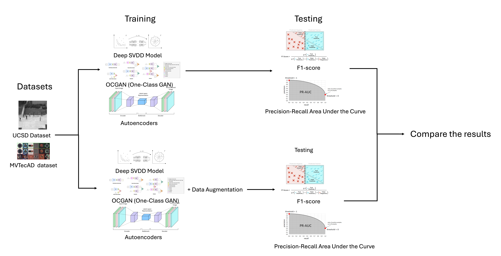

# Data Augmentation Strategies for Improving One-Class Classification in Anomaly Detection
This repository presents our research on enhancing one-class classification for anomaly detection through advanced data augmentation techniques. We integrate methods such as CutPaste, Elastic Deformations, Fourier Domain Adaptation (FDA), and simulated environmental effects into Deep SVDD, OCGAN, and Autoencoder frameworks to enrich training data diversity. The project systematically evaluates each augmentation—and their combinations—on benchmark datasets, measuring improvements in detection accuracy, false positive rates, and model generalization. By introducing a robust augmentation pipeline across multiple OCC architectures, this work contributes scalable strategies for reducing missed anomalies and false alarms in real-world deployment scenarios.  
  

## Overview

One-Class Classification (OCC) models for anomaly detection often suffer from limited data diversity, which impairs generalization and reduces detection accuracy in real-world applications. Conventional OCC approaches such as Deep SVDD, OCGAN, and Autoencoders are particularly sensitive to unseen variations during deployment, resulting in elevated false positive rates and missed anomalies.

This project explores **advanced data augmentation** techniques to enrich training data and improve OCC model robustness. We implement and systematically evaluate the following augmentation methods on benchmark anomaly detection datasets:

- **CutPaste**  
- **Elastic Deformations**  
- **Fourier Domain Adaptation (FDA)**  
- **Simulated Environmental Effects**  

Our goal is to quantify how each technique (and their combinations) affects anomaly detection performance, false positive rates, and model generalization across Deep SVDD, OCGAN, and Autoencoder frameworks.

## Workflow

Below is the high-level pipeline showing how we train and test each OCC model, with and without data augmentation, before comparing the results:

<p align="center">
  
</p>

1. **Datasets**  
   - UCSD Anomaly Detection
   - Avenue   
   -  MVTec AD  
3. **Training**  
   - Deep SVDD  
   - OCGAN  
   - Autoencoder  
4. **Testing & Metrics**  
   - F1-score  
   - Precision–Recall AUC  
5. **Compare Results**  
   - Measure gains from each augmentation strategy  


## Data Augmentation Techniques

1. **CutPaste**  
   Randomly crops and pastes patches within images to simulate localized defects.  

2. **Elastic Deformations**  
   Applies random grid distortions to mimic non-rigid deformations.  

3. **Fourier Domain Adaptation (FDA)**  
   Swaps low-frequency amplitude components between source and target domains to introduce style variations.  

4. **Simulated Environmental Effects**  
   Adds realistic noise, blur, lighting shifts, and weather artifacts (e.g., rain, fog).  


## Repository Structure

- **`Autoencoder/`**  
  Contains the Autoencoder pipeline for each dataset:  
  - **`UCSD_ped1/`**, **`UCSD_ped2/`**, **`Avenue/`**, **`MVTec/`**  
    - `train_autoencoder.py` — train data with no augmentations
    - `train_autoencoder_CutPaste.py` — train with CutPaste augmentations  
    - `train_autoencoder_ElasticDeformations.py` — train with Elastic Deformations 
    - `train_autoencoder_EnvironmentalEffects.py` — train with Simulated Environmental Effects 
    - `train_autoencoder_FDA.py` — train with Fourier Domain Adaptation (FDA)     


- **`OCGAN/`**  
  Houses the OCGAN workflow per dataset:  
  - **`UCSD_ped1/`**, **`UCSD_ped2/`**, **`Avenue/`**, **`MVTec/`**  
    - `train_autoencoder.py` — train data with no augmentations
    - `train_autoencoder_CutPaste.py` — train with CutPaste augmentations  
    - `train_autoencoder_ElasticDeformations.py` — train with Elastic Deformations 
    - `train_autoencoder_EnvironmentalEffects.py` — train with Simulated Environmental Effects 
    - `train_autoencoder_FDA.py` — train with Fourier Domain Adaptation (FDA)  

- **`Deep SVDD/`**  
  Implements Deep SVDD for each dataset:  
  - **`UCSD_ped1/`**, **`UCSD_ped2/`**, **`Avenue/`**, **`MVTec/`**  
    - `train_autoencoder.py` — train data with no augmentations
    - `train_autoencoder_CutPaste.py` — train with CutPaste augmentations  
    - `train_autoencoder_ElasticDeformations.py` — train with Elastic Deformations 
    - `train_autoencoder_EnvironmentalEffects.py` — train with Simulated Environmental Effects 
    - `train_autoencoder_FDA.py` — train with Fourier Domain Adaptation (FDA)  

- **`README.md`**  
  Project overview, installation, usage, and structure.

- **`requirements.txt`**  
  Python dependencies and version requirements.


### Dataset

This project leverages several widely-used benchmark datasets in the anomaly detection domain:

- **[UCSD Anomaly Detection Dataset](http://www.svcl.ucsd.edu/projects/anomaly/dataset.htm)**  
  Grayscale surveillance videos of pedestrian walkways recorded by a fixed elevated camera, split into Ped1 (34 train / 36 test) and Ped2 (16 train / 12 test) clips labeled per frame.

- **[CUHK Avenue Dataset](https://www.kaggle.com/datasets/vibhavvasudevan/avenue)**  
  16 training videos of normal campus-avenue activity and 21 testing videos (15 328 train / 15 324 test frames) containing anomalies such as wrong-direction walking, loitering, and novel objects.

- **[MVTec Anomaly Detection (MVTec AD)](https://www.kaggle.com/datasets/ipythonx/mvtec-ad?select=toothbrush)**  
  5354 high-resolution images across 15 industrial object and texture categories, with defect-free images for training and both normal and defective samples (with pixel-precise masks) for testing.


## Getting Started

### Installation

1. **Clone the Repository**  
   ```bash
   git clone https://github.com/your-username/occ-data-augmentation.git
   cd occ-data-augmentation
    ```

2. **Install Requirements**
    ```bash
    pip install -r requirements.txt
    ```
3. **Add the Datasets**
   
   Create a data/ folder in the project root

   Download or copy the datasets into `data/` folder
   ```bash
    mkdir -p data/
    ```
## Train and Evaluate the Models

Each model folder contains one “vanilla” training script plus one for each augmentation strategy:

### 1. Autoencoder

```bash
# move into the dataset folder
cd Autoencoder/<Dataset>
# e.g. cd Autoencoder/Avenue

# train without augmentation
python train_autoencoder.py --dataset_path /path/to/Avenue

# -- or with a specific augmentation --
python train_autoencoder_CutPaste.py --dataset_path /path/to/Avenue
python train_autoencoder_ElasticDeform.py --dataset_path /path/to/Avenue
python train_autoencoder_FDA.py --dataset_path /path/to/Avenue
python train_autoencoder_Environmental.py --dataset_path /path/to/Avenue
```
For MVTec, you can point --dataset_path at any category folder(e.g. toothbrush, wood, grid):
```bash
cd Autoencoder/Mvtec
python train_autoencoder_FDA.py --dataset_path /path/to/mvtec_ad/toothbrush

```
